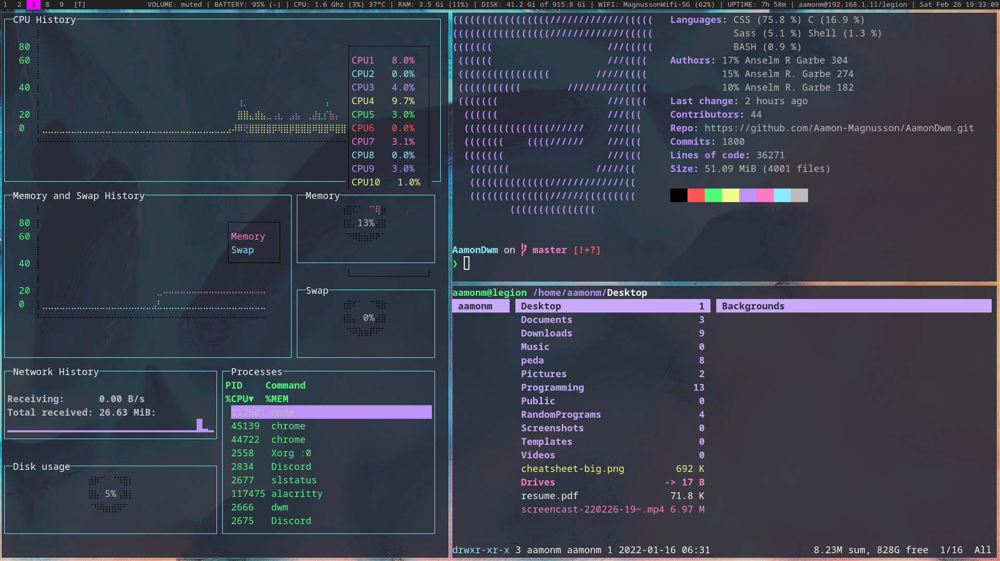

# Aamon's DWM config

Here is my DWM config.
Included are other Suckless pieces of software:

- Dmenu
- Slstatus
- Slock



My config is meant to be simple and functional.

## Menu

This config includes a dmenu based menu system, which holds several dmenu scripts. To use it hit SUPER + X.

The scripts included in the menu will be added to frequently.

## Instalation

Set up is pretty simple:

```
git clone https://github.com/Aamon-Magnusson/AamonDwm.git
cd AamonDwm # or whatever you named the directory
./install.sh
```

***One thing that should be done before the install script is changing the username in slock's config.h file***

For a basic display of the keybindings hit SUPER + O.

A list of patches remains inside the Patches folder.

## Removal

If for any reason you would like to uninstall AamonDwm the following command can be ran:

```
./uninstall.sh
```

Selecting "Yes" will keep some files that are used in other WMs that I have configured. Selecting "Remove All" will remove them as well.

## Dependencies

The setup only currently works for Arch based distros.
All dependencies can be seen within the PackageList files. 
They can also be installed automatically with the install script.

## TODO

- Make the setup work on Debian based distros
- Have dynamic color theming for Suckless programs (header file)
- Give options for which programs to install
