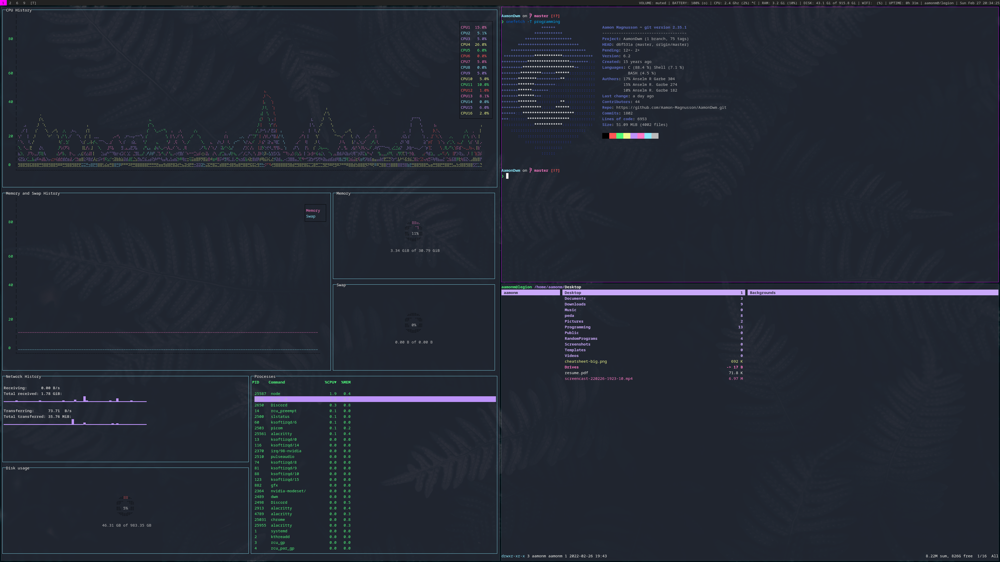

# Aamon's DWM config

Here is my DWM config.



## Menu

This config includes a dmenu based menu system, which holds several dmenu scripts. To use it hit SUPER + X.

## Instalation

Set up is pretty simple:

```
git clone https://github.com/Aamon-Magnusson/AamonDwm.git
cd AamonDwm # or whatever you named the directory
./install.sh
```

For a basic display of the keybindings hit SUPER + O.

A list of patches remains inside the Patches folder.

## Dependencies

For the most part it is pretty easy to change the default programs, like the terminal, but here are the dependencies:

### From Pacman

- alacritty
- discord
- qutebrowser
- pcmanfm 
- ranger
- xautolock
- flameshot 
- feh
- picom
- pamixer
- dunst
- gtop
- xorg-xrandr
- arandr
- lxappearance
- bluez-utils
- wmctrl
- clipmenu

### From AUR

- google-chrome (google-chrome-stable)
- networkmanager-dmenu-git ([Here's the github](https://github.com/firecat53/networkmanager-dmenu))

### From git

- dmenu (My [Dmenu config](https://github.com/Aamon-Magnusson/AamonDmenu) can and should be used with this config)
- slock (My [slock config](https://github.com/Aamon-Magnusson/AamonSlock))
- slstatus (My [slstatus config](https://github.com/Aamon-Magnusson/AamonSlstatus))

## Removal

If for any reason you would like to uninstall AamonDwm the following command can be ran:

```
./uninstall.sh
```

Selecting "Yes" will keep some files that are used in other WMs that I have configured. Selecting "Remove All" will remove them as well.
